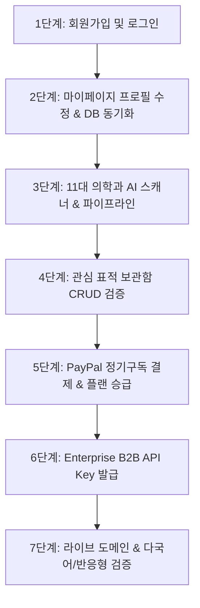

# 🧪 [테스트 플랜] Aetheria Bio Portal 순차적 E2E 서비스 검증 시나리오

**작성자**: AI 개발부장 코즈 (Coz)  
**대상 시스템**: Aetheria Bio Portal ([https://www.aetheria.bio/](https://www.aetheria.bio/) 및 [http://localhost:8080/](http://localhost:8080/))  
**목적**: AWS EC2 백엔드 최종 개통 전, 현재 구축 완료된 **Supabase DB + PayPal 결제 + Vercel 라이브 환경**의 전 기능 정상 작동 여부를 단계별로 정밀 검증하기 위함.

---

## 📋 순차적 E2E 테스트 시나리오 개요

---

## 1. 🔑 [Test Case 1] 신규 회원가입 & 로그인 검증
- **검증 항목**: Google OAuth 팝업 로그인 및 이메일 회원가입/로그인 정상 작동 여부
- **순차적 실행 절차**:
  1. 헤더 우측상단 `[로그인 / 회원가입]` 버튼 클릭 ➡️ 회원가입 모달 열림 확인.
  2. `[Google 계정으로 빠른 가입]` 클릭 ➡️ Google OAuth 팝업 정상 작동 확인.
  3. 이메일 가입 탭 선택 ➡️ 이메일 및 비밀번호 입력 후 `[회원가입]` 버튼 클릭.
- **기대 결과**:
  - 회원가입 성공 즉시 Supabase PostgreSQL `users` 테이블에 신규 계정 자동 등록.
  - 헤더 우측 프로필 영역에 본인 이메일 및 계정 이름 표시 (`queriesRemaining: 3` 할당).

---

## 2. 👤 [Test Case 2] 마이페이지 프로필 수정 & DB 실시간 저장 검증
- **검증 항목**: 마이페이지 폼에서 이름, 소속 기관, 직책 수정 시 Supabase DB 반영 여부
- **순차적 실행 절차**:
  1. 우측 상단 `[마이페이지]` 버튼 클릭.
  2. `연구자 프로필 관리` 탭 선택 ➡️ `연구자 성함`, `소속 연구 기관`, `연구 직책` 입력 (예: 홍길동 박사 / 서울대학교 / 책임연구원).
  3. `[회원 정보 수정 저장]` 버튼 클릭.
- **기대 결과**:
  - `upsertUserProfileDB` 함수가 트리거되어 Supabase DB `users` 테이블에 실시간 저장됨.
  - 마이페이지 상단 프로필 카드 렌더링이 즉시 반영되며, 새로고침 시에도 최신 정보 유지.

---

## 3. 🔬 [Test Case 3] 11대 의학과 AI 스캐너 & 38개 사이언스 스킬 파이프라인
- **검증 항목**: 신경외과~안티에이징 11대 의학과 카테고리 전환 및 3D 뷰어, 스캐닝 로그 DB 저장 검증
- **순차적 실행 절차**:
  1. 11대 의학과 탭(🧠 신경외과, ⚡ 신경과, 🦴 정형외과, 😊 정신건강의학과, ❤️ 순환기내과, 🩺 종양내과, 🧬 내분비내과, 🛡️ 류마티스, ✨ 피부과, 👁️ 안과, ⏳ 안티에이징) 클릭 ➡️ 카테고리 뷰 전환 확인.
  2. `[3D 단백질 구조 뷰어 (AlphaFold 3D)]` 버튼 클릭 ➡️ 3DMol.js 분자 뷰어 모달 팝업 및 PDB 랜더링 확인.
  3. 표적 카드에서 `[스캔]` 또는 파이프라인 실행 클릭 ➡️ AI 파이프라인 분석 진행.
- **기대 결과**:
  - 분석 완료 시 Supabase DB `skill_audit_logs` 테이블에 실행 이력(`skill_id`, `query_target`, `execution_time_ms`) 자동 등록.
  - 마이페이지 `AI 스캐닝 활동 기록` 탭에 실시간 로그 항목 추가 렌더링.

---

## 4. ⭐ [Test Case 4] 관심 표적 보관함 (Target Vault) CRUD 검증
- **검증 항목**: 관심 타깃 북마크 저장 및 마이페이지 보관함 연동 검증
- **순차적 실행 절차**:
  1. 의학과 스캐너 표적 카드 우측 상단 `[⭐ 관심 타깃 저장]` 클릭.
  2. 마이페이지 `[관심 표적 보관함]` 탭 클릭 ➡️ 등록된 관심 표적 카드 렌더링 확인.
  3. 표적 카드 우측 상단 휴지통(`Trash2`) 아이콘 클릭 ➡️ 보관함 삭제.
- **기대 결과**:
  - 보관함 추가/삭제 시 `localStorage` 및 마이페이지 수량(`Target Vault: N개`) 즉시 연동.
  - 보관함이 비었을 때 빈 보관함 안락 안내문 정상 출력.

---

## 5. 💳 [Test Case 5] PayPal 정기구독 결제 & 플랜 승급 검증
- **검증 항목**: Pro ($490/월) 및 Enterprise ($2,500/월) PayPal 결제 팝업 및 구독 DB 저장
- **순차적 실행 절차**:
  1. `[Pro 구독 업그레이드 ($490)]` 클릭 ➡️ 결제 모달 열림.
  2. 결제 방식 `PayPal` 선택 ➡️ `[PayWithPayPal]` 결제 버튼 클릭.
  3. PayPal 팝업에서 결제 승인 진행 ➡️ 승인 완료 콜백 수신.
- **기대 결과**:
  - `recordSubscriptionDB` 함수 트리거 ➡️ Supabase DB `subscriptions` 테이블에 결제 영수증 저장.
  - `users` 테이블의 플랜 등급이 `pro`로 자동 승급되며 쿼리 횟수 `100회`로 확장.
  - 마이페이지 `구독 & 결제 관리` 탭에서 정산 ID 및 영수증 히스토리 렌더링.

---

## 6. 🔑 [Test Case 6] Enterprise B2B 개발자 콘솔 & API Key 발급
- **검증 항목**: Enterprise 플랜 유저 전용 API Key 생성/삭제 및 Live API 쿼리 검증
- **순차적 실행 절차**:
  1. 마이페이지 또는 배너 우측 `[Enterprise B2B 콘솔]` 버튼 클릭.
  2. 온보딩 탭에서 `[신규 API Key 발급]` 클릭 ➡️ 암호화 Key 발급 확인.
  3. `개발자 API 샌드박스` 탭 이동 ➡️ Python/cURL SDK 선택 후 `[실시간 API 쿼리 테스트]` 클릭.
- **기대 결과**:
  - Supabase DB `api_keys` 테이블에 API Key가 정상 생성 및 조회됨 (`fetchApiKeysDB`).
  - 샌드박스 응답창에 200 OK 타깃 스캔 JSON 결과 반환.

---

## 7. 🌐 [Test Case 7] 글로벌 도메인, SSL & 다국어/반응형 검증
- **검증 항목**: `https://www.aetheria.bio/` 보안 인증서 및 다국어 지원 검증
- **순차적 실행 절차**:
  1. 브라우저에서 `https://www.aetheria.bio/` 접속 ➡️ 자물쇠 아이콘(Cloudflare Full Strict SSL) 정상 동작 확인.
  2. 헤더 좌측 `🌐 [한국어]` 드롭다운 클릭 ➡️ `English`, `日本語`, `中文` 선택.
  3. 브라우저 창 너비를 모바일 크기(375px)로 축소 ➡️ 사이드바 햄버거 메뉴 및 스크롤바 작동 확인.
- **기대 결과**:
  - 80개 국어 번역이 UI 전체에 실시간 반영되며, 모바일 환경에서도 Layout 깨짐 없이 쾌적하게 구동.

---

## 📊 테스트 실행 체크리스트 (Summary Checklist)

| 시나리오 | 테스트 명칭 | 핵심 검증 대상 | 상태 |
| :---: | :--- | :--- | :---: |
| **TC-01** | 신규 회원가입 & 로그인 | Google OAuth & 이메일 가입 ➡️ `users` DB 생성 | `[대기]` |
| **TC-02** | 프로필 수정 & DB 동기화 | 이름/소속/직책 수정 ➡️ `upsertUserProfileDB` 연동 | `[대기]` |
| **TC-03** | 11대 의학과 AI 스캐닝 | 카테고리 전환, 3D 뷰어 ➡️ `skill_audit_logs` DB 기입 | `[대기]` |
| **TC-04** | 관심 표적 보관함 CRUD | 타깃 저장 및 삭제 ➡️ 마이페이지 보관함 연동 | `[대기]` |
| **TC-05** | PayPal 정기구독 결제 | Pro/Enterprise 결제 ➡️ `subscriptions` DB & 플랜 승급 | `[대기]` |
| **TC-06** | B2B API Key 발급 | API 키 생성/삭제 ➡️ `api_keys` DB 연동 & Live Query | `[대기]` |
| **TC-07** | 글로벌 도메인 & 반응형 | Cloudflare SSL, 80개국 다국어, 모바일 UI 레이아웃 | `[대기]` |

---
*본 테스트 플랜은 프로젝트 `workLog/` 폴더 내 `서비스_E2E_테스트플랜_20260807.md`로 영구 보관됩니다.*
